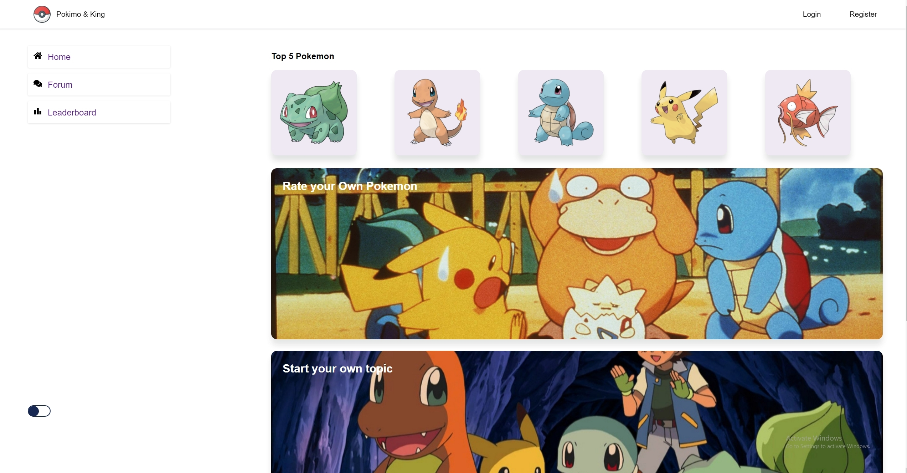

# Pokemon Forum
### Full stack pokemon forum app using REACT, PostgreSQL, Prisma ORM, Express.

Clone repository and then create ```.env``` file and add a database using elephantSQL for example:

### ``` DATABASE_URL = "addyourdbhere?schema=prisma" ```
### ``` DATABASE_SHADOW = "addyourshadowdbhere?schema=shadow" ```
### ``` SECRET="yoursecretkey" ```

Then run commands below:

### ```npm ci ```
### ```npm run start```



[](https://gyazo.com/90e484c4ad748e32cf6cd1dfac412cb7)

